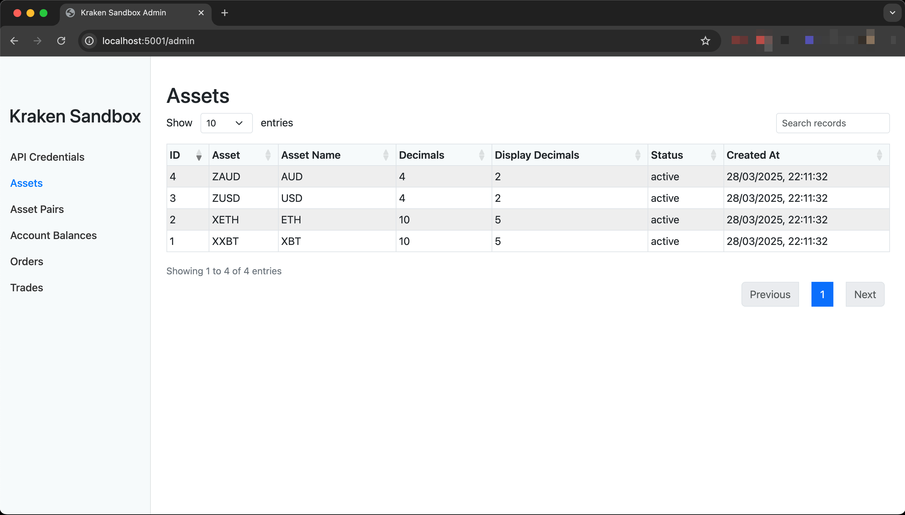

# Kraken Sandbox API

A local development environment that mimics the [Kraken Spot REST API](https://docs.kraken.com/api/docs/rest-api/add-order).

### Why?
Kraken only provides a UAT environment to "Business Pro" accounts and "third party service developers" both of which require several hoops to create. Kraken support told me:

>Our usual recommendation for testing is to use a real account and place real orders for very small amounts by adding small funds in the account.

Umm, fuck that.

## Getting Started Using Docker (Recommended)

1. Clone this repository:
   ```
   git clone https://github.com/sudosammy/kraken-sandbox.git
   cd kraken-sandbox
   ```

2. Create the docker network. This will expose the container at `kraken-sandbox:5555` to other containers on this network:
   ```
   docker network create kraken_network
   ```

3. Start the Docker container:
   ```
   docker compose up
   ```

4. The API will be available on the host at http://localhost:5555 and API credentials will be printed to the console and are available at http://localhost:5555/admin. If you started the server with `docker compose up -d` you can also find the credentials via `docker compose logs kraken-sandbox`

## Manual Setup

1. Clone this repository:
   ```
   git clone https://github.com/sudosammy/kraken-sandbox.git
   cd kraken-sandbox
   ```

2. Install dependencies:
   ```
   pip install -r requirements.txt
   ```

3. Start the API server:
   ```
   python app.py
   ```

4. The API will be available on the host at http://localhost:5555 and API credentials will be printed to the console & are available at http://localhost:5555/admin.

## Supported Endpoints

### Public Endpoints (All)
- `/0/public/Time` - Get server time
- `/0/public/Assets` - Get information about assets
- `/0/public/AssetPairs` - Get information about trading pairs
- `/0/public/Ticker` - Get current price information
- `/0/public/OHLC` - Get Open, High, Low, Close data
- `/0/public/Depth` - Get order book
- `/0/public/Trades` - Get recent trades
- `/0/public/Spread` - Get recent spread data
- `/0/public/SystemStatus` - Get system status

### Private Endpoints
- `/0/private/Balance` - Get account balances
- `/0/private/OpenOrders` - Get open orders
- `/0/private/AddOrder` - Place a market order
- `/0/private/ClosedOrders` - Get closed orders
- `/0/private/QueryTrades` - Get detailed information about specific trades
- `/0/private/TradesHistory` - Get trade history
- `/0/private/CancelOrder` - Cancel an open order
- `/0/private/EditOrder` - Amend an existing order

## Supported Trading Pairs

- BTC/USD (XXBTZUSD)
- ETH/USD (XETHZUSD)
- BTC/AUD (XXBTZAUD)
- ETH/AUD (XETHZAUD)

To add new trading pairs, update the `seed_asset_pairs` function in `database.py`.

## Order Execution Behavior

The Kraken Sandbox API simulates realistic order execution behavior:

- **Market Orders**: Always execute immediately at the current market price.
- **Limit Orders**: 
  - Limit orders placed within 5% of the current market price are automatically executed.
  - Limit orders placed more than 5% away from the current market price remain open.
  - This behavior allows for testing both order execution and order management (cancellation, editing).

## Making API Requests

If you want to access the API from another container, ensure you have created the `kraken_network` network and specify it via `--network` or an `external: true` network configuration in the other container's `docker-compose.yml`. Then the sandbox API will be available at `http://kraken-sandbox:5555`.

#### Public Endpoints

Public endpoints can be accessed directly via GET (or POST) requests:

```
curl http://localhost:5555/0/public/Ticker?pair=XXBTZUSD
```

#### Private Endpoints

Private endpoints require API key authentication:

```
curl -X POST \
  -H "API-Key: YOUR_API_KEY" \
  -H "API-Sign: YOUR_API_SIGN" \
  -d "nonce=$(date +%s000)" \
  http://localhost:5555/0/private/Balance
```

## API Key Authentication

The API automatically generates an API key and secret when first started. These credentials will be printed to the console. All private API requests must include:

1. `API-Key` header with your API key
2. `API-Sign` header with a valid signature
3. `nonce` parameter in the request body

For testing purposes, the sandbox has simplified authentication - it only checks if the API key exists.

## Testing the API

A test script (`test_kraken_sandbox.sh`) is included to verify that all API endpoints are working correctly. To run the test script:

```bash
# After starting the API server
./test_kraken_sandbox.sh localhost:5555 your_api_key your_api_secret
```

The test script will:
1. Test all public endpoints
2. Test all private endpoints
3. Place various types of orders (market, limit)
4. Test order cancellation and editing
5. Verify trades and order history

## Configuring Logging

By default, logging is set to `INFO` which will print all API requests to the console. Set an environment variable `LOG_LEVEL=ERROR` to change this.

## Admin Dashboard

The Kraken Sandbox includes an admin dashboard at `http://localhost:5555/admin` that provides an interface to view all data in the database.



## Resetting the API

Simply delete the SQLite database in `data/kraken_sandbox.db` and re-run the program. It will regenerate and reseed a new clean database.